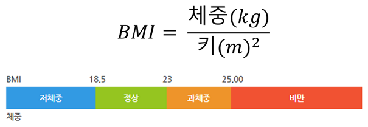

# SHealth BMI (cpp)

# Overview
- 삼성 헬스에서는 수집된 데이터를 활용하여 사용자들의 나이대(ex. 20대, 30대, 40대 등)별 저체중/정상체중/과체중/비만의 통계를 계산하고자 합니다.
- 수집 중 누락된 체중값이 있으며 같은 나이대(ex. 20대, 30대, 40대 등)의 평균을 적용합니다. 체중 0이 누락된 경우 입니다.
- 수집 데이터는 ID, 나이, 몸무게(kg), 키(cm)이며, BMI는 체중(kg) / 키(m)제곱 으로 계산합니다.
- BMI 기준으로 18.5이하 저체중, 18.5초과 23미만 정상체중, 23이상 25미만 과체중, 25이상 비만으로 판단합니다.

- 제공된 코드에는 다양한 코드 품질 문제가 있습니다. 


## data sample
- 입력 데이터 (shealth.dat)
```
id,age,weight,height
93705,66,79.5,158.3
93708,66,53.5,150.2
93709,75,88.8,151.1
... (이하 생략)
```
- 각 라인별 ID, 나이, 체중(kg), 키(cm) 순서 입니다.


# 생성형AI를 활용한 Activities (6 시간)
1. 문제 코드 분석 및 코드 스멜 찾기 (1시간)
- 기본 코드구조, BMI 로직 이해 
- 코드 스멜 찾기 
2. 1차 리펙토링 (클린코드 관점, 아래 내용을 순차적으로 수행) (1시간) 
- 네이밍 개선
- 하드코드 및 전역변수 제거 
- 함수 추출
- 반복/중복 제거
3. UnitTest 작성 (1시간)
- BMI 계산 로직 TC
- Age 평균치 보정 로직 TC
- 정상/저체중/과체중/비만 분류 TC
- 예외상황 TC
4. 기능 개선 (2시간)
- SRP에 따른 책임 분리등 리팩토링 
- 특정 연령대의 BMI 분포 비율 계산 기능 추가
- Height가 0인 경우에 대한 평균치 보정 로직 추가 
- BMI 정상 범위 사용자 목록 조회 기능 추가
- 전체 사용자 대비 각 BMI 범주 비율 계산 기능 추가
5. 회고 및 발표 (1시간) 
- 실습 목표와 달성도 
- 코드 품질 Before & After
- AI를 어떻게 활용했나? 도움이 된 순간과 한계는? 
- TC를 추가해보면서 개선에 미친 영향, TC 작성 팁
- 클린코드와 리팩토링에서 느낀 장점과 어려운점


# 주의 사항
- 코드 품질을 높이기 위해 C++의 경우 STL를 사용하셔도 됩니다.

